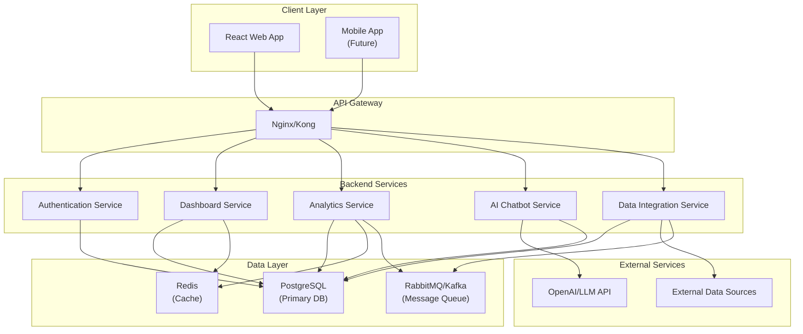

# IntelliBI - Project Scope & Development Plan

## Project Overview

**Project Name:** IntelliBI - Intelligent Business Intelligence Platform

**Description:** A full-stack business intelligence platform that enables organizations to visualize data, generate insights, and interact with their data through an AI-powered conversational assistant. The platform features real-time analytics dashboards, data integration capabilities, and intelligent query processing.

**Duration:** 20 Days (January 27 - February 15, 2026)

**Repository:** https://github.com/muktaBlueitek/intellibi

## Technology Stack

### Backend
- **Framework:** Python FastAPI (async, high-performance)
- **Database:** PostgreSQL (primary), Redis (caching)
- **AI/ML:** Python (LangChain, OpenAI API or open-source LLM)
- **Data Processing:** Pandas, NumPy, SQLAlchemy
- **APIs:** RESTful APIs, WebSocket for real-time updates
- **Authentication:** JWT tokens, OAuth2

### Frontend
- **Framework:** React 18 with TypeScript
- **UI Library:** Material-UI or Ant Design
- **Charts:** Recharts, D3.js, Chart.js
- **State Management:** Redux Toolkit or Zustand
- **Real-time:** Socket.io-client

### Infrastructure
- **Containerization:** Docker, Docker Compose
- **API Gateway:** Kong or Nginx
- **Message Queue:** RabbitMQ or Apache Kafka (for distributed processing)
- **Monitoring:** Prometheus, Grafana (optional)

## Core Features

### 1. Data Analytics Dashboard
- Multi-widget dashboard with customizable layouts
- Real-time data visualization (line charts, bar charts, pie charts, heatmaps)
- Data filtering and drill-down capabilities
- Export functionality (PDF, CSV, Excel)

### 2. AI-Powered Chatbot
- Natural language query interface
- Data insights generation
- Report generation from conversational queries
- Context-aware responses

### 3. Data Integration
- CSV/Excel file upload
- Database connectors (PostgreSQL, MySQL, MongoDB)
- REST API data sources
- Scheduled data sync

### 4. User Management
- Role-based access control (RBAC)
- User authentication and authorization
- Team collaboration features

### 5. Performance & Scalability
- Caching layer (Redis)
- Database query optimization
- API rate limiting
- Horizontal scaling support

## Daily Development Plan

### Day 1: Project Scope & Git Setup ✅
- [x] Create project repository structure
- [x] Initialize Git repository
- [x] Create README.md with project overview
- [x] Set up .gitignore files
- [x] Create ProjectScope.md document
- [x] Define project architecture and tech stack decisions

### Day 2: Backend Foundation Setup
- Initialize FastAPI project structure
- Set up virtual environment and dependencies (requirements.txt)
- Configure database connection (PostgreSQL)
- Create base API structure with health check endpoint
- Set up Docker and Docker Compose for local development
- Create initial database schema migrations

### Day 3: Authentication & User Management
- Implement JWT authentication system
- Create user registration and login endpoints
- Set up password hashing (bcrypt)
- Implement role-based access control (RBAC)
- Create user management API endpoints
- Add authentication middleware

### Day 4: Database Models & Core Entities
- Design and implement database models (Users, Dashboards, DataSources, Widgets)
- Create SQLAlchemy models and relationships
- Set up database migrations with Alembic
- Create seed data scripts
- Implement CRUD operations for core entities

### Day 5: Data Source Integration - File Upload
- Implement file upload endpoint (CSV/Excel)
- Create data parsing service (Pandas)
- Implement data validation and cleaning
- Store uploaded data in database
- Create API endpoints for data source management

### Day 6: Data Source Integration - Database Connectors
- Implement database connector service
- Create connection pooling
- Add support for PostgreSQL and MySQL connectors
- Implement query execution service
- Create API endpoints for database connections

### Day 7: Analytics Engine - Query Processing
- Build SQL query builder service
- Implement data aggregation functions
- Create time-series data processing
- Add filtering and sorting capabilities
- Implement query optimization logic

### Day 8: Dashboard API - Backend
- Create dashboard CRUD endpoints
- Implement widget management API
- Add dashboard layout persistence
- Create dashboard sharing functionality
- Implement dashboard versioning

### Day 9: AI Chatbot - Backend Integration
- Set up LangChain framework
- Integrate OpenAI API (or configure open-source LLM)
- Create chatbot service for natural language processing
- Implement query-to-SQL conversion
- Create conversation context management
- Add chatbot API endpoints

### Day 10: AI Chatbot - Query Execution
- Connect chatbot to analytics engine
- Implement result interpretation and summarization
- Create visualization suggestions from queries
- Add error handling and fallback responses
- Implement query history tracking

### Day 11: Frontend Foundation Setup
- Initialize React project with TypeScript
- Set up project structure and folder organization
- Configure routing (React Router)
- Set up state management (Redux Toolkit)
- Create base UI components and theme
- Set up API client (Axios)

### Day 12: Authentication UI
- Create login and registration pages
- Implement JWT token management
- Add protected route components
- Create user profile page
- Implement logout functionality

### Day 13: Dashboard UI - Layout System
- Create dashboard grid layout component
- Implement drag-and-drop widget placement
- Create widget container components
- Add dashboard save/load functionality
- Implement responsive design

### Day 14: Data Visualization Components
- Create chart components (Line, Bar, Pie, Area)
- Implement data table component
- Add chart configuration options
- Create real-time data update mechanism
- Implement chart export functionality

### Day 15: Data Source Management UI
- Create data source connection interface
- Implement file upload UI with progress
- Add database connection form
- Create data preview component
- Implement data source list and management

### Day 16: AI Chatbot UI
- Create chatbot interface component
- Implement message history display
- Add typing indicators
- Create query suggestion buttons
- Implement result visualization in chat
- Add conversation export feature

### Day 17: Performance Optimization
- Implement Redis caching layer
- Add API response caching
- Optimize database queries (indexing, query optimization)
- Implement lazy loading for dashboard widgets
- Add pagination for large datasets
- Optimize frontend bundle size

### Day 18: Real-time Features & WebSocket
- Implement WebSocket connection for real-time updates
- Add live data streaming to dashboards
- Create notification system
- Implement collaborative features (multi-user editing)
- Add real-time chat updates

### Day 19: Testing & Quality Assurance
- Write unit tests for backend services (pytest)
- Create integration tests for API endpoints
- Add frontend component tests (Jest, React Testing Library)
- Implement end-to-end tests (Playwright or Cypress)
- Fix bugs and edge cases
- Add error handling improvements

### Day 20: Documentation & Deployment Prep
- Write comprehensive API documentation (Swagger/OpenAPI)
- Create user documentation and guides
- Set up production configuration
- Create deployment scripts (Docker, docker-compose.prod.yml)
- Add environment variable management
- Create project presentation/demo materials
- Final code review and cleanup

## Project Structure

```
intellibi/
├── backend/
│   ├── app/
│   │   ├── api/
│   │   │   ├── v1/
│   │   │   │   ├── endpoints/
│   │   │   │   │   ├── auth.py
│   │   │   │   │   ├── dashboards.py
│   │   │   │   │   ├── datasources.py
│   │   │   │   │   ├── chatbot.py
│   │   │   │   │   └── users.py
│   │   │   │   └── deps.py
│   │   ├── core/
│   │   │   ├── config.py
│   │   │   ├── security.py
│   │   │   └── database.py
│   │   ├── models/
│   │   ├── schemas/
│   │   ├── services/
│   │   │   ├── analytics.py
│   │   │   ├── chatbot.py
│   │   │   ├── datasource.py
│   │   │   └── dashboard.py
│   │   └── main.py
│   ├── tests/
│   ├── alembic/
│   ├── requirements.txt
│   └── Dockerfile
├── frontend/
│   ├── src/
│   │   ├── components/
│   │   │   ├── Dashboard/
│   │   │   ├── Charts/
│   │   │   ├── Chatbot/
│   │   │   └── Common/
│   │   ├── pages/
│   │   ├── services/
│   │   ├── store/
│   │   ├── hooks/
│   │   └── App.tsx
│   ├── package.json
│   └── Dockerfile
├── docker-compose.yml
├── .gitignore
├── README.md
└── ProjectScope.md
```

## Key Algorithms & Data Structures

1. **Query Optimization:** Implement query plan optimization for analytics queries
2. **Data Aggregation:** Efficient time-series aggregation algorithms
3. **Caching Strategy:** LRU cache for frequently accessed queries
4. **Natural Language Processing:** Tokenization, intent classification for chatbot
5. **Graph Algorithms:** For dashboard dependency resolution
6. **Sorting & Filtering:** Efficient data processing for large datasets

## System Design Considerations

- **Microservices Architecture:** Separate services for analytics, chatbot, and data integration
- **API Gateway:** Centralized routing and authentication
- **Message Queue:** For async data processing tasks
- **Database Sharding:** For horizontal scaling (future enhancement)
- **CDN Integration:** For static assets and improved performance

## Success Metrics

- API response time < 200ms (95th percentile)
- Dashboard load time < 2 seconds
- Chatbot response time < 3 seconds
- Support for 10,000+ data points per visualization
- Concurrent user support: 100+ users

## Architecture Diagram



## Future Enhancements (Post 20 Days)

- Mobile app (React Native)
- Advanced ML models for predictive analytics
- Custom visualization builder
- Multi-tenant architecture
- Advanced security features (SSO, 2FA)
- Automated report scheduling
- Data governance and compliance features

## Development Principles

- **Clean Code:** Follow SOLID principles and maintainable code structure
- **Testing:** Write tests alongside development (TDD approach)
- **Documentation:** Keep code and API documentation up-to-date
- **Version Control:** Daily commits showing incremental progress
- **Performance:** Optimize for scalability from the start
- **Security:** Implement security best practices throughout

## Notes

- This project demonstrates full-stack development capabilities
- Focus on modern technology stacks and best practices
- Showcase system design and architecture skills
- Demonstrate AI/ML integration in production applications
- Highlight performance optimization and scalability considerations

